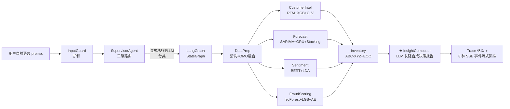
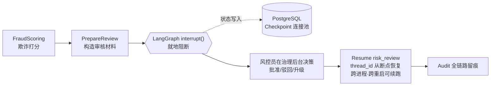
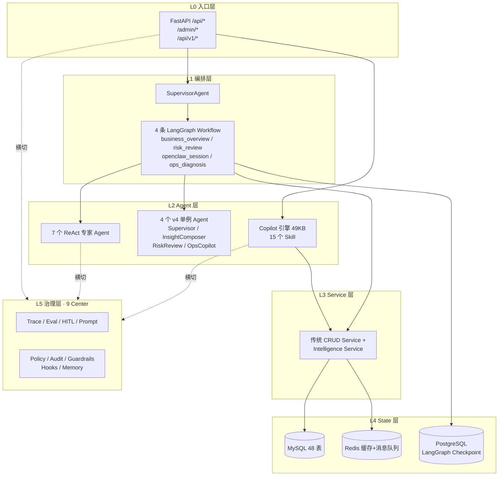

<div align="center">

# 柠优生活大数据智能决策平台

### AI Native 多 Agent 企业级经营决策平台

**面向连锁零售 B 端经营决策场景的个人长期开源项目**


**11 Agent · 4 LangGraph Workflow · 15 Copilot Skill · 9 Governance Center · 48 MySQL Tables · 23 ML Artifacts**

[核心痛点](#-解决的核心痛点) · [核心逻辑流](#-核心逻辑流) · [架构总览](#-架构总览) · [快速启动](#-快速启动) · [MiMo 接入](#-mimo-接入规划)

</div>

---

## 📌 项目定位

本项目是面向**连锁零售 B 端经营决策场景**的 AI Native 多 Agent 平台。把"客户洞察 / 销售预测 / 风控审核 / 舆情分析 / 库存优化 / 智能客服 / 关联推荐"7 条业务线全部改造成 Agent 驱动的工作流,让一句自然语言 prompt 在 **5–10 分钟产出可追溯、可解释、可人工干预的决策报告**,把传统模式下跨团队 2–3 天的协作压缩到一次 SSE 流式对话。

> 不是"ChatGPT 包一层 UI",而是带**企业级护栏 / 审计 / HITL / 评测 / 降级链路**的真产品。

---

## 🎯 解决的核心痛点

| # | 传统模式痛点 | 本项目解法 |
|---|---|---|
| 1 | 数据孤岛、口径不一致,一次经营复盘要 4 个团队串行 2–3 天 | Supervisor 三级路由 + 4 专家 Agent 并行 + InsightComposer LLM 合成,端到端 5–10 分钟 |
| 2 | 分析报告高度依赖分析师,每月重复写 SQL 拉图 | 一句 prompt 自动触发 LangGraph Workflow,结论可复现、可追溯 |
| 3 | 风控滞后,高风险事后抽检、中风险缺人工复核 | Workflow B HITL `interrupt()` + PG Checkpoint,人机协作断点恢复 |
| 4 | 客服重复问答成本高,80% 是 FAQ | Workflow C OpenClaw + KB RAG + 15 Copilot Skill Function Calling |
| 5 | 市面 AI Demo 缺企业级护栏 / 审计 / HITL / 评测 / 降级 | 9 个治理中心:Trace / Eval / HITL / Prompt / Policy / Audit / Guardrails / Hooks / Memory |

---

## 🧠 核心逻辑流

项目落地 3 条典型**长链推理 + 多 Agent 协作**链路。

### ① Workflow A · 经营总览(多 Agent 并行 + 长链合成)



- **Supervisor 三级路由**:L1 显式 `request_type` → L2 规则关键词(4 大类 50+ 词)→ L3 LLM 意图分类(置信度 < 0.6 时 15s 超时保护 + `execute_with_retry` 重试),全不命中降级 `business_overview`(置信度 0.3)
- **每个专家 Agent 内部跑 ReAct 五步**:`perceive → reason → act → reflect → output`
- **InsightComposer**:长链 LLM 合成,Structured Output 强校验 + Grounding 后验引用标注

### ② Workflow B · 风险审核(HITL + Checkpoint)



解决传统 AI 决策"要么全自动要么全人工"的二元困境。

### ③ Copilot 对话(自研 Agent Harness · 对标 Claude Code)

Copilot 引擎主文件 **49 KB**,每次对话跑 **10 阶段 Pipeline**:

```
InputGuard → Context Build (三层记忆 Rules/Memory/Messages)
 → Memory Recall (Top-K by importance)
 → Dedup (SkillCallDeduplicator 防函数调用死循环: LRU + TTL=120s + max_repeat=3)
 → Router → Skill Exec (15 Function Calling Skill 可多轮组合调用)
 → Token Governor (超限自动压缩) → Output PII (剥离)
 → Persist (消息+记忆+工件) → Finalize (无论成败都执行)
```

- 典型一次复杂问答触发 **3–5 次 Skill 循环调用**
- **25 种 SSE EventType** 实时展示完整决策链:`context_status / security_check / memory_recall / skill_cache_hit / decision_step / tool_call / artifact / thinking / text_delta / ...`

---

## 🏛 架构总览



---

## 📊 规模数据

| 维度 | 规模 |
|---|---|
| **Agent 数量** | 11 个(7 ReAct 专家 + 4 v4 单例) |
| **LangGraph Workflow** | 4 条(主文件 30KB + 12.8KB + 7.7KB + 7KB) |
| **Copilot Skill** | 15 个(Function Calling + Auto Discover) |
| **MySQL 表** | 48 张(`auth5 / business8 / governance18 / evaluation6 / copilot6 / kb5`) |
| **治理中心** | 9 个(Trace / Eval / HITL / Prompt / Policy / Audit / Guardrails / Hooks / Memory) |
| **ML 模型产物** | 23 个(客户 5 / 预测 6 / 欺诈 7 / NLP 5) |
| **SSE EventType** | Copilot 25 种 · Workflow 8 种 |
| **代码来源** | 95%+ 由 Cursor / Claude Code / Windsurf AI 协同开发 |

### ML 模型关键指标

| 模型 | 指标 | 数值 |
|---|---|---|
| 欺诈检测 LightGBM | AUC | **0.9992** |
| 情感分析 BERT-Chinese | Accuracy | **0.942** |
| 销售预测 Stacking | MAPE | **19.5%** |
| 客户流失 XGBoost | AUC | 0.88+ |

---

## 🛠 技术栈

```text
前端  Vue 3.4 + Pinia + Element Plus + ECharts 5 + Vite 5
后端  FastAPI + SQLAlchemy + asyncmy + PyMySQL + Pydantic v2
编排  LangGraph StateGraph + langchain-openai + langgraph-checkpoint-postgres
数据  MySQL 8.0 (业务) + Redis 7 (缓存+消息) + PostgreSQL 16 (Checkpoint)
部署  Docker Compose + Nginx (SSE 专调) + Ubuntu 22.04
RBAC  JWT + bcrypt + 五表模型 + 三层权限矩阵
ML    sklearn / xgboost / lightgbm / torch / transformers / prophet
      lifetimes / jieba / gensim / shap / mlxtend / BGE-small-zh-v1.5
```

---

## 🚀 快速启动

### 前置依赖

- Docker + Docker Compose
- Git
- (可选)Python 3.11+ 用于本地开发后端
- (可选)Node 18+ 用于本地开发前端

### 一键启动

```bash
# 1. 克隆仓库
git clone https://github.com/xiaohuo02/lnys-decision-platform.git
cd lnys-decision-platform

# 2. 复制环境变量样板,按需填充
cp .env.docker.example .env.docker
# 编辑 .env.docker 填入:
#   - DB_PASSWORD / SECRET_KEY / LLM_API_KEY / LLM_BASE_URL
#   - REGISTER_AUTH_CODE (员工注册码)

# 3. 启动 5 容器(前端 / 后端 / MySQL / Redis / PostgreSQL)
docker compose --env-file .env.docker up -d --build

# 4. 等待 30s 让 MySQL/PG 完成初始化,访问:
#   - 前端:        http://localhost:3000
#   - 后端 API:     http://localhost:8000
#   - API Docs:    http://localhost:8000/docs
```

### 初始化管理员账号

首次启动后,需手动注册管理员或运行内置 seed 流程:

```bash
# 方式 A:通过 /admin/auth/register 接口注册(需提供 REGISTER_AUTH_CODE)
# 方式 B:直接 docker exec 进 mysql 容器执行 init.sql 中的 RBAC seed
```

---

## 🤖 AI 协作开发

本项目 **95%+ 代码由 AI 工具协同开发**完成:

- **Windsurf IDE** —— 主力开发 IDE,`.windsurf/` 目录保留完整的 AI 协作规则与 skill
- **Cursor / Claude Code** —— 代码生成、重构、架构决策对话
- **自研 Copilot 引擎** —— 既是"AI 驱动的产品",也是内部"AI 协作者"的产物

`.windsurf/` 目录结构:

```
.windsurf/
├── rules/           # AI 协作规则(后端 Python / 前端 Vue / SQL migration / 安全清理)
├── skills/          # 可复用 skill 集合
└── workflows/       # 标准化流程
```

---

## 🚀 MiMo 接入规划

本项目正在申请 **Xiaomi MiMo Orbit 百万亿 Token 创造者激励计划**。

由于 **MiMo API 与 OpenAI SDK 完全兼容**,仅需修改 2 个 env 变量即可把全链路切换到 **Xiaomi MiMo-V2.5-Pro**:

```bash
# .env(切换只需这两行)
LLM_BASE_URL=https://api.mimo.xiaomi.com/v1
LLM_MODEL_NAME=mimo-v2.5-pro
```

Token 将主要消耗于:

1. **Copilot Skill 多轮 Function Calling**(高频,主力消耗)
2. **InsightComposer 长链合成**(单次输出 2k–4k token)
3. **Supervisor 意图分类**(高频短请求)
4. **RiskReview HITL 审核摘要 / OpsCopilot 运维问答**
5. **100 万上下文窗口**用于跨季度全量报表聚合与历史对话回放

### 承诺产出

- **MiMo-V2.5-Pro vs Qwen3.5-plus 的 A/B 评测报告**,覆盖 5 个维度:路由准确率 / Structured Output 合规率 / Function Calling 成功率 / 端到端延迟 / 单次请求成本
- 基于项目自带的 `PeriodicEvaluator` 评测中心跑全量回放
- 评测数据和分析结论**公开回馈社区**

---

## 📚 架构文档

| 类别 | 位置 |
|---|---|
| 架构决策(ADR) | `docs/architecture/01_前端架构决策.md` ~ `07_*.md` |
| Agent 全链路 | `docs/AGENT_MODEL_FULL_CHAIN.md` |
| 关联分析重设计 | `docs/ASSOCIATION_REDESIGN.md` |
| Agent 代码审计 | `docs/前端Agent代码审计报告.md` |
| v4 技术规划 | `docs/plan/方案_10_v4技术规划文档.md` |
| v4 任务清单 | `docs/plan/方案_11_v4开发任务清单.md` |
| AI 协作规则 | `.windsurf/rules/` |

---

## 📦 项目状态

- ✅ Docker 5 容器编排可运行(Vue3 / FastAPI / MySQL / Redis / PostgreSQL Checkpoint)
- ✅ 48 张 MySQL 表全量建表,种子数据脚本就绪
- ✅ 11 Agent · 4 Workflow · 15 Skill 全部可用
- ✅ 23 个 ML 模型产物训练脚本完整(欺诈 AUC=0.9992 / BERT 情感 Acc=0.942)
- 🔄 Pipeline v2 / AppContainer / PromptStore 灰度中(feature flag 控制)
- 🔄 持续迭代中,欢迎 Issue / PR

---

## 📮 联系 & 授权

如需**完整源码访问**(用于评估 / 合作)或 **MiMo 团队评测**,请通过 GitHub Issue 联系。

---

<div align="center">

**柠优生活大数据智能决策平台** · 个人长期开源项目

Built with ❤️ + Cursor + Claude Code + Windsurf

</div>
